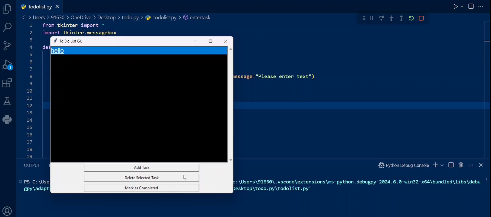

# to-do-list
✅ Simple to-do list app with Python's Tkinter 🐍. Add, complete, and delete tasks with ease!📝

# showcase 
- 

## table of content
- [Overview](#overview)
- [Dependencies](#dependencies)
- [License](#license)

## Overview

- A Python todo list using Tkinter GUI 🖥️ manages tasks 📝 with add, delete, and list features 🗃️, offering an interactive user interface.

## Dependencies

- tkinter (for GUI interface)
 

## License
- to do list is licensed under the gnu -see the license file for details.
